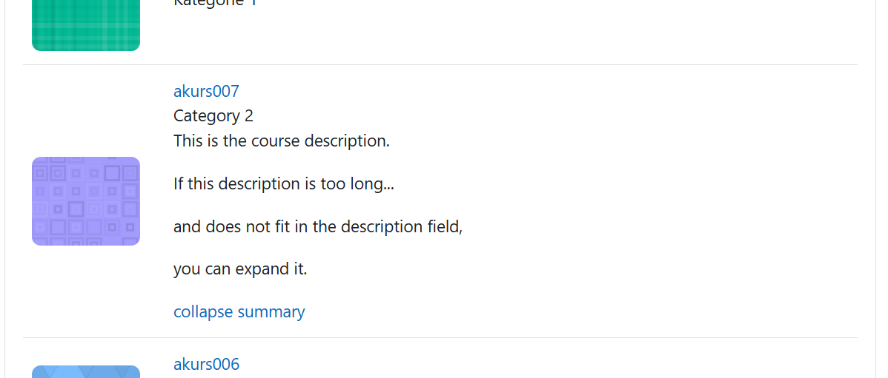

# User instructions
Course search is a block which lets you serarch courses for following criteria:  
- Fulltext search of course name and description
- Course category
- If the course is over, ongoing or planned for the future
- Course custom fields
- Tags
You can choose between two result formats: list and cards.
The searchable dropdown fields allow multiple selections and constrain each other. That means: If you select something in one field, the other fields will only show valid selection option which will return results.
  
The plugin consists of two main sections:  
- Search section
- Results section
## Search section

### Using the searchable dropdown fields
1. Click on a field
- A dropdown opens with a fixed number of options.
- Custom select fields will additionally display a description on the top if there is one available.
2. To see other options, type a search term into the search. The options list will update itself after a moment.
- The Options list is divided into a secton with selected items an one with items available for selection.
- To clear the search field, click the "x" symbol on the right.
3. Select an item by clicking on it. The item will appear in the selected items section.
- To unselect an item, click on it.
- The results section of the plugin will update immediately.
Depending on the number of available search fields, there might be a "Expand search" button to reveal additional fields.
### Full text search
The full text search applies the search term to the course name and description.  
It may show a "No results" page.
## Results section
This section contains the search results either in list form or in card form which displays the found courses.  
If there is a course description, you can expand it in list view.  

At the bottom, there are buttons to step through the results if there are too many to display on one page.  

